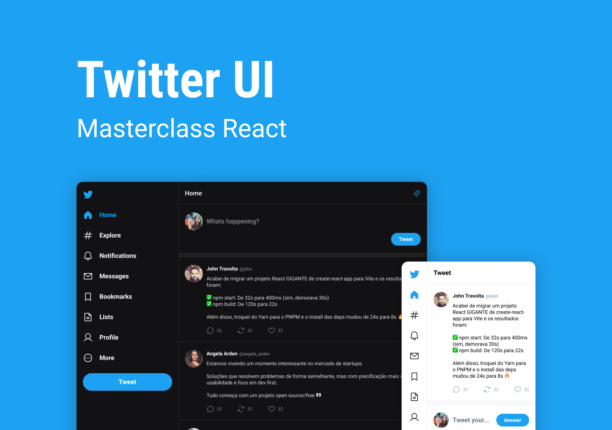

# UI Twitter - Masterclass React
> This project is clone of UI Twitter
&nbsp;
# Contents
- [UI Twitter - Masterclass React](#ui-twitter---masterclass-react)
- [Contents](#contents)
- [About](#about)
- [TO-DO:](#to-do)
- [Installation](#installation)
    - [Pre-requisites](#pre-requisites)
    - [Run this project](#run-this-project)
      - [Clone this repository](#clone-this-repository)
- [Technologies](#technologies)
# About
**This project is clone of UI Twitter**

&nbsp;

# TO-DO:
[ ] Change CSS to TailwindCSS <br />
[ ] Make Dark Theme

&nbsp;

# Installation
### Pre-requisites

Before starting, you will need to have the following tools installed on your machine: [Git](https://git-scm.com), [Node.js](https://nodejs.org/en/) and [Npm](https://www.npmjs.com/). It's good to have an editor to work with the code like [VSCode](https://code.visualstudio.com/).

### Run this project 
#### Clone this repository
```bash
git clone https://github.com/felipecepluki/ui-twitter.git
```
# Technologies
The following tools were used in building the project: <br />
<a href="https://vitejs.dev/">
  
</a>
<a href="https://www.typescriptlang.org/">
  
</a>
<a href="https://developer.mozilla.org/en-US/docs/Web/CSS">
  
</a>

> **This project not is for comercial use, is used for personal study only**